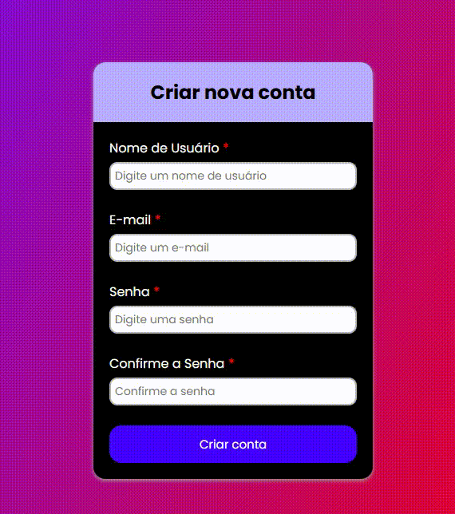

# 📝 Validador de Formulário

Este projeto é um validador de campos de formulário para criação de conta.

## 📷 Preview



## 🚀 Funcionalidades

- Validação dos campos obrigatórios:
  - Nome de Usuário
  - E-mail
  - Senha
  - Confirmação de Senha
- Validação de e-mail com regex
- Verificação de senha com mínimo de 7 caracteres
- Feedback visual com ícones e cores para erros e acertos
- Mensagens de erro contextuais
- Layout moderno com responsividade básica

## 🛠️ Tecnologias Utilizadas

- HTML5
- CSS3 (com `@import` de fontes via Google Fonts)
- JavaScript puro (sem frameworks)
- Font Awesome para ícones

## ▶️ Como Usar

Entre no site: [Validador de Formulário](https://validador-de-formulario-efrals.netlify.app/)

OU

1. Clone este repositório:

   ```bash
   git clone https://github.com/Efrals/validador-de-formulario.git
   ```

2. Navegue até a pasta do projeto

3. Abra o arquivo `index.html` em seu navegador.
